<p align="center">

</p>
<h1 align="center">Ace-Translate</h1>
<p align="center">
一款本地离线的翻译程序
</p>


<p align="center">
  
  
  
</p>


## Features

支持多种翻译场景。

- 汉译英和英译汉。
- 文本翻译
- 划词翻译
- 截图翻译
- 文件翻译，包括TXT文件、Excel、PPT、PDF、文档图片和Word
- 文档图片翻译


## INSTALL

推荐使用`python3.8`+`paddlepaddle2.4.0`+`torch2.0.1`

### 1.拉代码

```
git clone https://github.com/tianclll/Ace-Translate.git
```

```
cd Ace-Translate
```


### 2.安装

#### 2.1安装PaddlePaddle

- GPU

  ```
  python3 -m pip install paddlepaddle-gpu -i https://mirror.baidu.com/pypi/simple
  ```

- CPU

  ```
  python3 -m pip install paddlepaddle -i https://mirror.baidu.com/pypi/simple
  ```

#### 2.2安装依赖

```
pip install -r requirements.txt
```

#### 2.3下载模型文件

点击[此处](https://www.123pan.com/s/knrdjv-AC5N3.html)下载

下载放入项目文件夹(Ace-Translate)中。

#### 2.4安装Pyaudio
需要运行语音翻译才安装

- Linux

  ```
  sudo apt-get install libasound2-dev
  weget https://files.portaudio.com/archives/pa_stable_v190700_20210406.tgz
  tar -xvf pa_stable_v190700_20210406.tgz
  cd portaudio
  ./configure
  make
  sudo make install
  make clean
  pip install pyaudio
  ```
- Mac

  ```
  sudo brew install libasound2-dev
  weget https://files.portaudio.com/archives/pa_stable_v190700_20210406.tgz
  tar -xvf pa_stable_v190700_20210406.tgz
  cd portaudio
  ./configure
  make
  sudo make install
  make clean
  pip install pyaudio
  ```
- Windows
  ```
  pip install pipwin
  pipwin install pyaudio
  ```
#### 2.5安装ImageMagick

需要运行视频翻译才安装
[官网下载地址](https://www.imagemagick.org/script/download.php)
### 3.设置

修改`config.conf`文件:

- 设置快捷键
- 设置运行设备 `gpu` or `cpu`

### 4.运行

注意：第一次运行各个模块都需要连网，下载相应模型

```
python main.py
```


## 效果展示

有"划词翻译","截图翻译","PDF翻译","文档图片翻译"四个功能,项目运行后会挂载到状态栏上，点击"x"时不会退出只是隐藏，点击状态栏上的"打开",就会弹出，点击状态栏上的"退出",才是真正的退出程序。

### 文本翻译

<p align="center">
  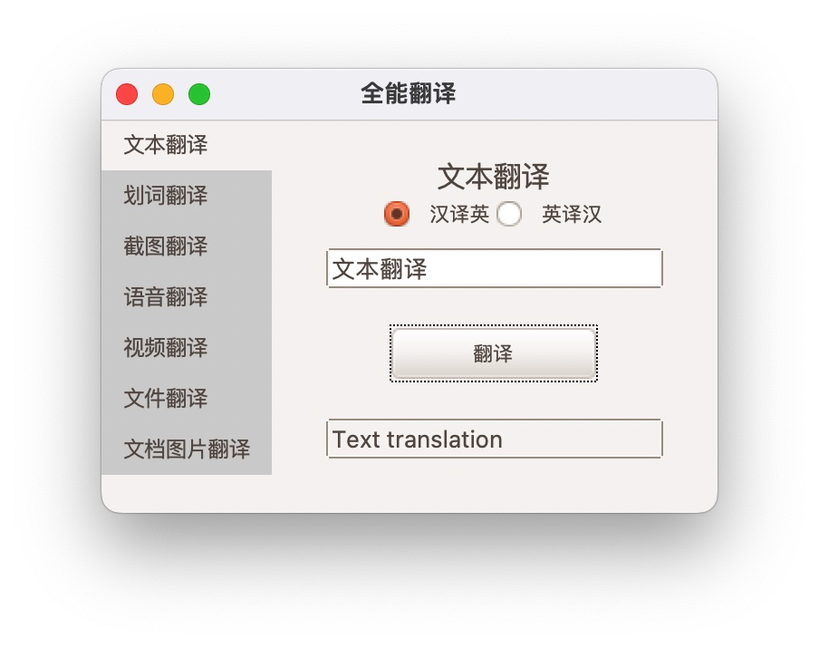
</p>

### 划词翻译

- 选择"汉译英"或者"英译汉"，然后点击开始
- 然后鼠标选中想要翻译的内容，点击复制
- 按下设置的快捷键，就能翻译了

<p align="center">
  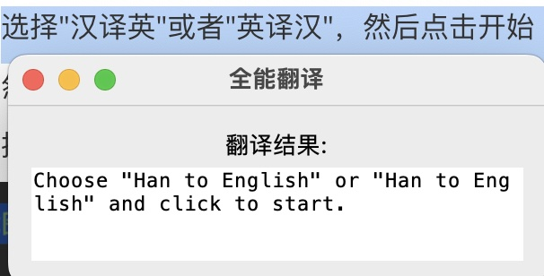
</p>

### 截图翻译

<p align="center">
  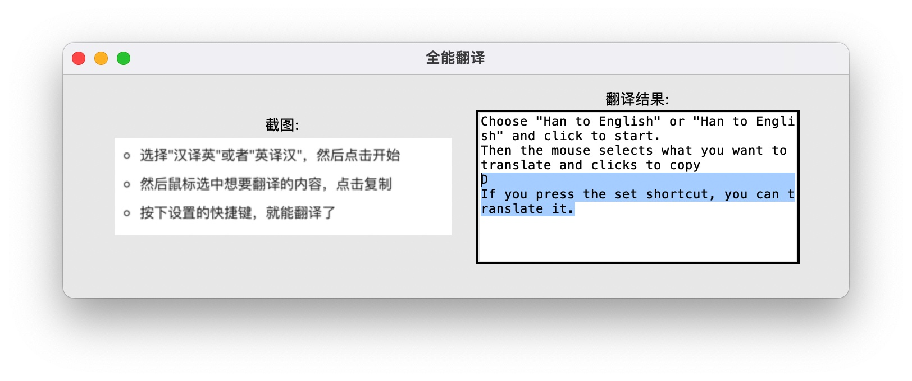
</p>

### 语音翻译

支持音频文件和语音录入

<p align="center">
  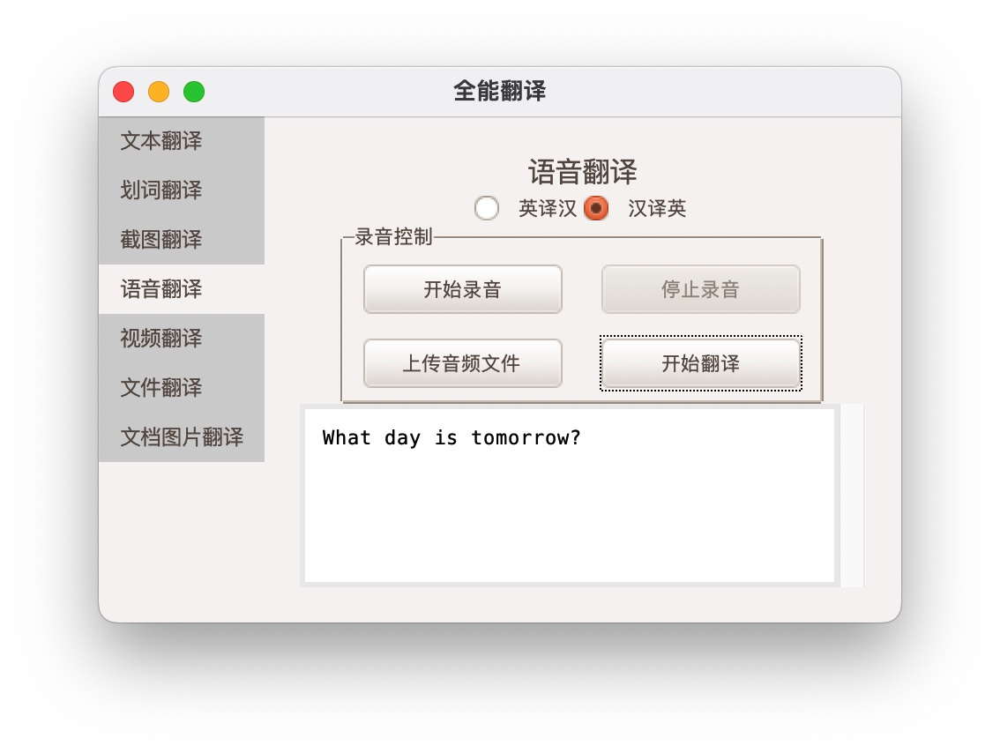
</p>

### 视频翻译

支持输出srt字幕文件和视频

<p align="center">
  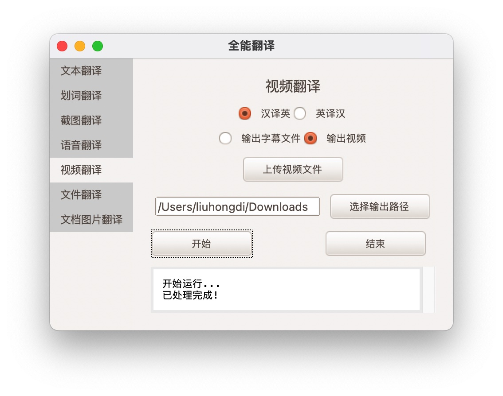
  
</p>


### 文件翻译

- TXT

<p align="center">
  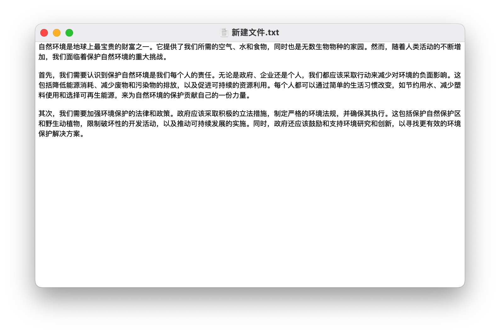
  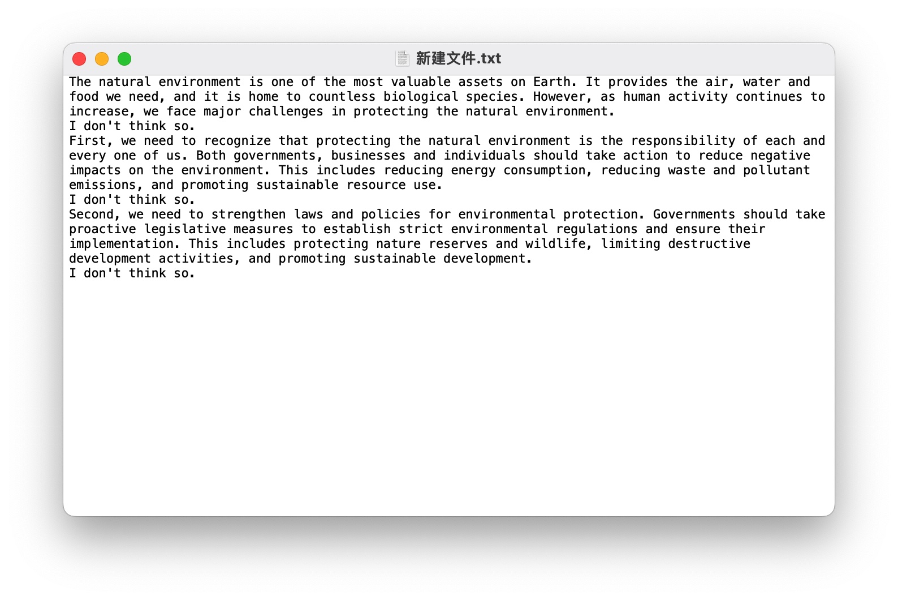
</p>


- PDF

<p align="center">
  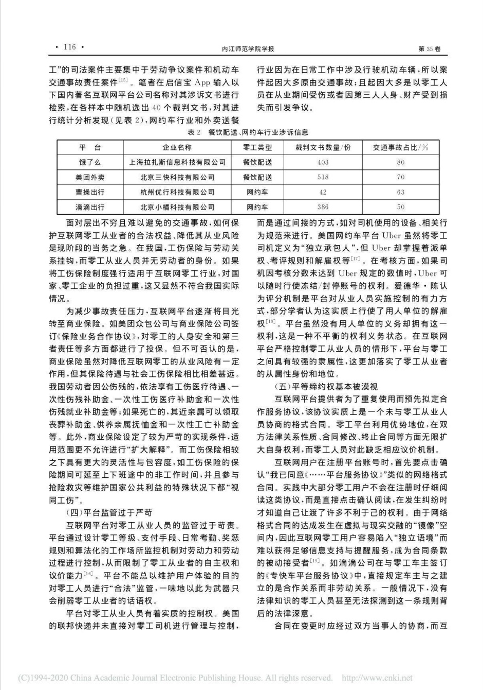
  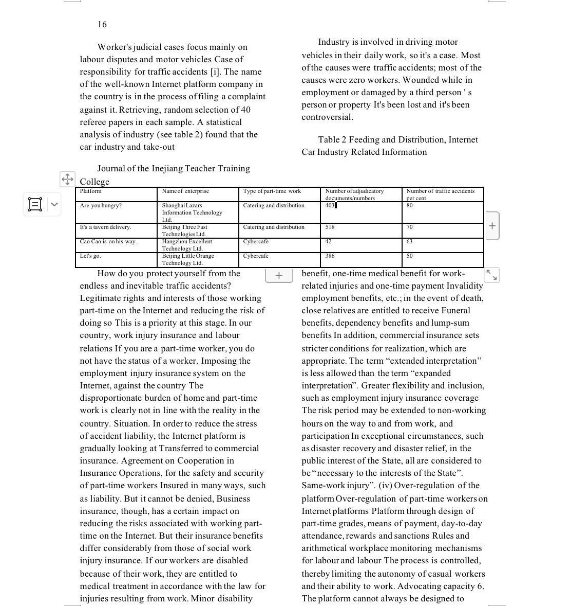
</p>


- Excel

<p align="center">
  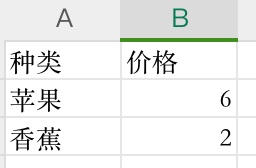
  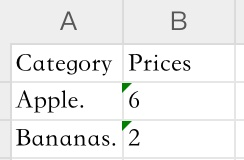
</p>


- Word

<p align="center">
  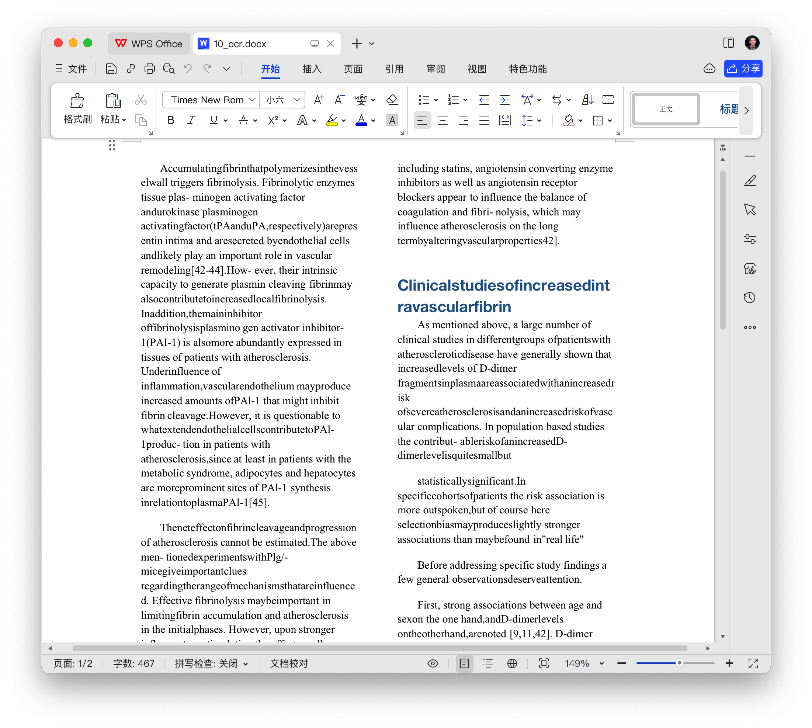
  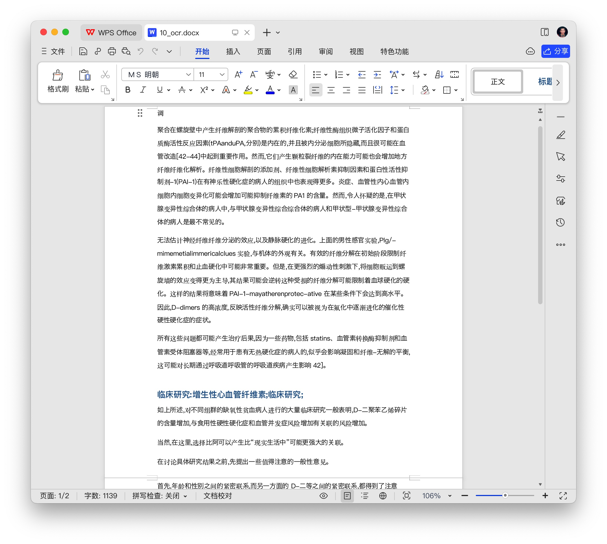
</p>


### 文档图片翻译

<p align="center">
  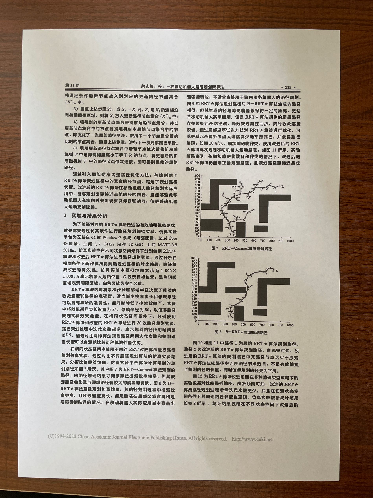
  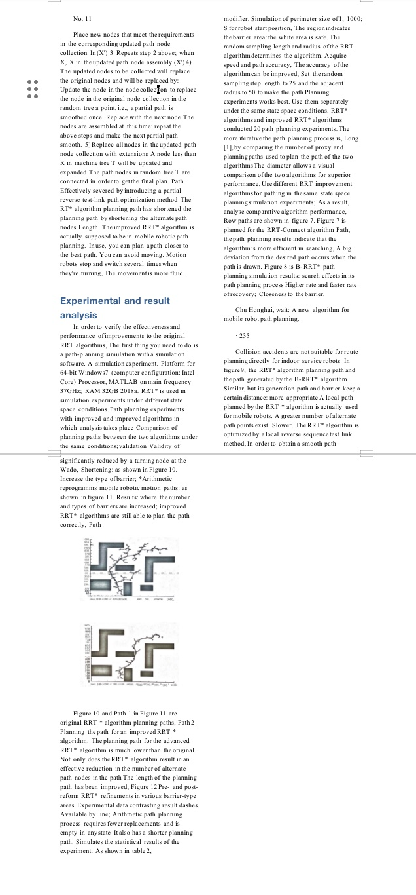
</p>


## 第三方开源软件

本项目使用了以下基于 Apache 许可证，版本 2.0 的第三方开源软件：

- 项目 PaddleOCR 由以下贡献者开发：
  - [WenmuZhou](https://github.com/WenmuZhou)
  - [LDOUBLEV](https://github.com/LDOUBLEV)
  - [MissPenguin](https://github.com/MissPenguin)
  ...
  [项目 PaddleOCR 链接](https://github.com/PaddlePaddle/PaddleOCR)

- 项目 PaddleSpeech 由以下贡献者开发：
  - [zh794390558](https://github.com/zh794390558)
  - [yt605155624](https://github.com/yt605155624)
  - [Jackwaterveg](https://github.com/Jackwaterveg)
  ...
  [项目 PaddleSpeech 链接](https://github.com/PaddlePaddle/PaddleSpeech)

- 项目 FastSAM 由以下贡献者开发：
  - [zxDeepDiver](https://github.com/zxDeepDiver)
  - [YinglongDu](https://github.com/YinglongDu)
  - [berry-ding](https://github.com/berry-ding)
  ...
  [项目 FastSAM 链接](https://github.com/CASIA-IVA-Lab/FastSAM)
## LICENSE

本项目的发布受[Apache 2.0 license](https://github.com/tianclll/Ace-Translate/blob/main/LICENSE)许可认证。

Copyright (c) 2023 tianclll
