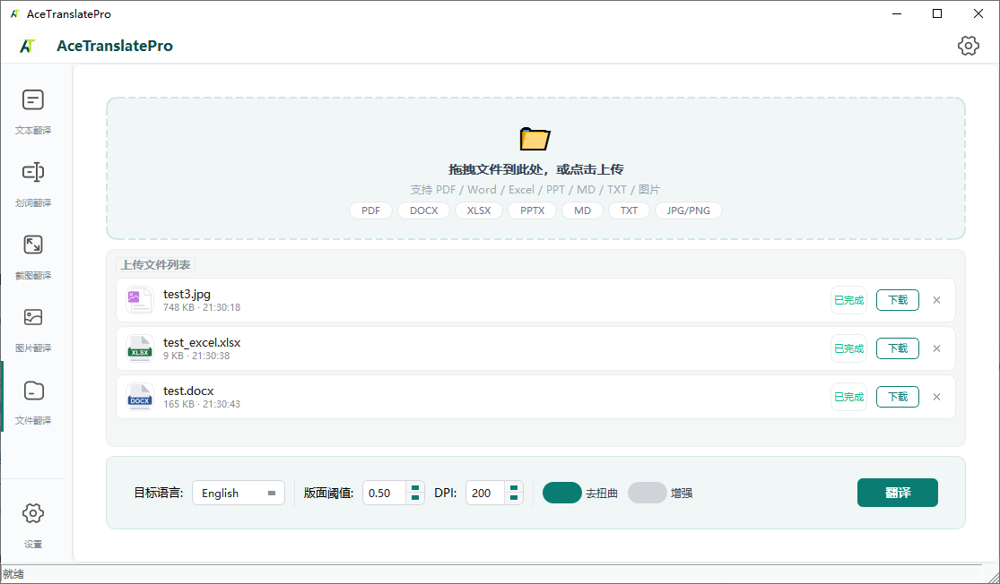

<div id="zh" align="center">


# AceTranslatePro

**离线文件翻译利器**

**🌐 中文 · [English](./README_en.md) · [日本語](./README_ja.md)**

> PDF / Word / Excel / PPT / 图片 → 翻译后保留原格式
> 纯本地运行 · 无需联网 · 隐私安全 · GPU/CPU 双模式

<p align="center">
  
  
  
  
</p>

</div>

---

## 💡 为什么选择 AceTranslatePro？

翻译学术论文、技术文档、产品手册时，你是否遇到过这些痛点？

- **在线翻译工具**需要上传文件，担心隐私泄露
- **格式全乱了**：PDF 里的表格、公式、图片排版翻译后面目全非
- **术语不一致**：同一个词在不同地方翻译不一样
- **专业内容翻译不准**：通用翻译引擎不懂你的领域术语
- **没有网络时无法工作**：出差、实验室、外网受限场景

**AceTranslatePro 就是为解决这些问题而生的。**

所有计算都在你的电脑上完成，文件无需上传，文档格式完整保留，术语自动统一，离线也能用。

<p align="center">
  
  
</p>

⭐ **如果觉得有用，请给个 Star！** 你的支持是我持续改进的最大动力。

---

## 📄 文件翻译

支持 PDF、Word、Excel、PPT、Markdown、TXT、图片等格式，拖入即译。

- **保留格式**：PDF 转 Markdown，表格、标题、列表结构完整保留
- **图片嵌入**：翻译后图片自动嵌入文档，不丢失图表
- **批量处理**：一次导入多个文件，自动排队翻译
- **批量翻译**：支持对整个文件夹批量翻译



---

## 📚 知识库 & 专有词

将翻译过的文档统一管理，建立你的个人翻译知识库。

- **文档归档**：导入 PDF/Word/Excel/PPT/MD/TXT，自动提取文本、生成摘要、建立索引
- **全文搜索**：支持标题和内容的关键词检索，快速找到所需资料
- **标签管理**：为文档打标签，分类整理，支持批量打标和导出
- **专有词注入**：导入术语表（如 "GPU → 图形处理器"），翻译时自动替换，保证术语一致
- **批量操作**：支持批量删除、批量导出 Markdown


---

## ✨ 其他功能

| 功能 | 说明 |
|------|------|
| 📝 **文本翻译** | 输入或粘贴文本，快速翻译 |
| 📄 **文件翻译** | PDF/Word/Excel/PPT/MD/TXT 批量翻译，保留格式 |
| 🖱️ **划词翻译** | 选中任意应用文字，`Ctrl+Shift+C` 弹出翻译 |
| 📷 **截图翻译** | 截取屏幕区域，自动 OCR + 翻译 |
| 🖼️ **图片翻译** | 上传图片，翻译后渲染回图片 |
| 🎤 **语音输入** | 点击麦克风按钮录音，自动识别语音语言并转文字 |
| 🔊 **朗读** | 支持中文/英文/日文等 TTS 朗读 |
| 🌐 **多语言界面** | 中文 / English / 日本語 切换 |
| 🔌 **REST API** | 内嵌 HTTP 服务器，16 个端点，支持脚本/Web 远程调用 |

---

## 📋 系统要求

- **操作系统**：Windows 10/11 64-bit
- **CPU**：支持 AVX2 指令集（2013 年后 Intel/AMD 处理器均可）
- **GPU（可选）**：NVIDIA 显卡 + CUDA 12.1，加速 OCR/翻译/ASR 推理
- **内存**：建议 16GB 以上
- **硬盘**：约 5GB（含模型文件）

---

## 🚀 快速开始

### 下载预编译版本

> [Releases](https://github.com/tianclll/Ace-Translate/releases) 页面提供 GPU 版和 CPU 版压缩包，下载解压即可运行。

### 从源码编译

#### 🔧 前置依赖

| 依赖 | 版本 | 下载 |
|------|------|------|
| Visual Studio 2022 | 17.x | [下载](https://visualstudio.microsoft.com/)（需"使用 C++ 的桌面开发"） |
| CMake | ≥ 3.10 | [下载](https://cmake.org/download/) |
| Qt | 6.5.2 MSVC 2019 64-bit | [下载](https://www.qt.io/download-open-source) |
| OpenCV | 4.8 | [下载](https://opencv.org/releases/) |
| ONNXRuntime (GPU) | 1.20.1 (CUDA 12.1) | [下载](https://github.com/microsoft/onnxruntime/releases) |
| ONNXRuntime (CPU) | 1.20.1 | [下载](https://github.com/microsoft/onnxruntime/releases) |
| CUDA Toolkit | 12.1 | [下载](https://developer.nvidia.com/cuda-toolkit)（仅 GPU 版需要） |
| Python | 3.8+ | [下载](https://www.python.org/downloads/)（编译 office2md 需要） |

> **Python 依赖**：编译 `office2md.exe` 需要安装以下包：
> ```bash
> pip install pyinstaller python-docx python-pptx openpyxl lxml pylatexenc
> ```

#### 1. 编译 llama.cpp

```bash
# GPU 版
cd external/llama.cpp
cmake -B build_gpu -DGGML_CUDA=ON -DCMAKE_BUILD_TYPE=Release
cmake --build build_gpu --config Release

# CPU 版
cmake -B build -DGGML_CUDA=OFF -DCMAKE_BUILD_TYPE=Release
cmake --build build --config Release
```

#### 2. 编译 office2md.exe

```bash
cd script
pyinstaller --onefile --name office2md --clean ^
    --hidden-import=docx ^
    --hidden-import=pptx ^
    --hidden-import=openpyxl ^
    --hidden-import=lxml ^
    --hidden-import=pylatexenc ^
    cli_converter.py
```

#### 3. 编译主程序

```bash
# GPU 版
双击 build_all.bat

# CPU 版
双击 build_cpu.bat
```

#### 📁 模型文件

将模型文件放入 `Release/models/` 目录：

```
models/
├── translation/          # 翻译模型（.gguf）
├── VLM/                  # 公式识别模型
├── layout/               # 版面分析模型
├── ocr/                  # OCR 检测/识别模型
├── ASR/                  # 语音识别模型
└── uvdoc/                # 图片矫正模型
```

> **模型下载**：[Hugging Face 🤗](https://huggingface.co/tianclll/AceTranslatePro-models)

---

## 🧩 技术栈

| 组件 | 技术 |
|------|------|
| 🖥️ 界面 | Qt 6.5.2 Widgets |
| 🖼️ 图像处理 | OpenCV 4.8 |
| 🔍 OCR | PaddleOCR (ONNXRuntime) |
| 📐 版面分析 | PPDocLayoutV2 (ONNXRuntime) |
| 🧮 公式识别 | VLM 多模态模型 (llama.cpp) |
| 🌐 翻译 | 本地 LLM (llama.cpp) |
| 🎤 语音识别 | SenseVoiceSmall (ONNXRuntime) |
| 📄 文档解析 | PDFium + office2md (Python) |

---

## 📄 许可证

MIT License

> 📌 旧版（Python 版）已迁移至 [`archive/old-python-version`](https://github.com/tianclll/Ace-Translate/tree/archive/old-python-version) 分支

---

<div align="center">

**Made with ❤️**

如需定制模型或服务器版本，请联系：`kriswu1106tc`

</div>
