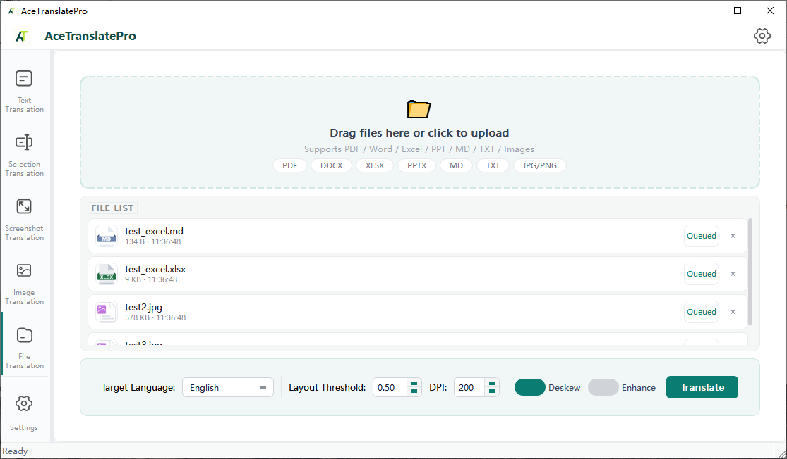

<div align="center">


# AceTranslatePro

**Offline File Translation Tool**

**🌐 [中文](./README.md) · English · [日本語](./README_ja.md)**

> PDF / Word / Excel / PPT / Images → Translated with original formatting preserved
> Runs locally · No internet needed · Privacy safe · GPU/CPU dual mode

<p align="center">
  
  
  
  
</p>

</div>

---

## 📄 File Translation

Supports PDF, Word, Excel, PPT, Markdown, TXT, and images. Drag and drop to translate.

- **Format preserved**: PDF converted to Markdown with tables, headings, and lists intact
- **Images embedded**: Translated images embedded back into documents
- **Batch processing**: Queue multiple files for translation at once



---

## ✨ Other Features

| Feature | Description |
|---------|-------------|
| 📝 **Text Translation** | Type or paste text, translate instantly |
| 🖱️ **Selection Translation** | Select text in any app, `Ctrl+Shift+C` to translate |
| 📷 **Screenshot Translation** | Capture screen area, auto OCR + translate |
| 🖼️ **Image Translation** | Upload image, translate and render back |
| 🎤 **Voice Input** | Click mic button, speech to text |
| 🔊 **Read Aloud** | Multilingual TTS (CN/EN/JP & more) |
| 🌐 **Multilingual UI** | Chinese / English / Japanese |
| 📚 **Knowledge Base** | Import documents, full-text search |
| 🏷️ **Glossary** | Import terminology, auto-inject into translations |

---

## 📋 System Requirements

- **OS**: Windows 10/11 64-bit
- **CPU**: AVX2 support (Intel/AMD from 2013+)
- **GPU (optional)**: NVIDIA GPU + CUDA 12.1 for accelerated OCR/Translation/ASR
- **RAM**: 16GB+ recommended
- **Storage**: ~5GB (including model files)

---

## 🚀 Quick Start

### Download Pre-built Release

> GPU and CPU packages available on the [Releases](https://github.com/tianclll/Ace-Translate/releases) page.

### Build from Source

#### 🔧 Prerequisites

| Dependency | Version | Download |
|-----------|---------|----------|
| Visual Studio 2022 | 17.x | [Download](https://visualstudio.microsoft.com/) |
| CMake | ≥ 3.10 | [Download](https://cmake.org/download/) |
| Qt | 6.5.2 MSVC 2019 64-bit | [Download](https://www.qt.io/download-open-source) |
| OpenCV | 4.8 | [Download](https://opencv.org/releases/) |
| ONNXRuntime (GPU) | 1.20.1 (CUDA 12.1) | [Download](https://github.com/microsoft/onnxruntime/releases) |
| ONNXRuntime (CPU) | 1.20.1 | [Download](https://github.com/microsoft/onnxruntime/releases) |
| CUDA Toolkit | 12.1 | [Download](https://developer.nvidia.com/cuda-toolkit) (GPU only) |
| Python | 3.8+ | [Download](https://www.python.org/downloads/) (for office2md) |

> **Python Dependencies**:
> ```bash
> pip install pyinstaller python-docx python-pptx openpyxl lxml pylatexenc
> ```

#### 1. Build llama.cpp

```bash
# GPU
cd external/llama.cpp
cmake -B build_gpu -DGGML_CUDA=ON -DCMAKE_BUILD_TYPE=Release
cmake --build build_gpu --config Release

# CPU
cmake -B build -DGGML_CUDA=OFF -DCMAKE_BUILD_TYPE=Release
cmake --build build --config Release
```

#### 2. Build office2md.exe

```bash
cd script
pyinstaller --onefile --name office2md --clean ^
    --hidden-import=docx ^
    --hidden-import=pptx ^
    --hidden-import=openpyxl ^
    --hidden-import=lxml ^
    --hidden-import=pylatexenc ^
    cli_converter.py
```

#### 3. Build Main Application

```bash
# GPU
Double-click build_all.bat

# CPU
Double-click build_cpu.bat
```

#### 📁 Model Files

Place model files in `Release/models/`:

```
models/
├── translation/          # Translation models (.gguf)
├── VLM/                  # Formula recognition model
├── layout/               # Layout analysis model
├── ocr/                  # OCR detection/recognition models
├── ASR/                  # Speech recognition model
└── uvdoc/                # Image correction model
```

> **Download models**: [Hugging Face 🤗](https://huggingface.co/tianclll/AceTranslatePro-models)

---

## 🧩 Tech Stack

| Component | Technology |
|-----------|-----------|
| 🖥️ UI | Qt 6.5.2 Widgets |
| 🖼️ Image Processing | OpenCV 4.8 |
| 🔍 OCR | PaddleOCR (ONNXRuntime) |
| 📐 Layout Analysis | PPDocLayoutV2 (ONNXRuntime) |
| 🧮 Formula Recognition | VLM Multimodal model (llama.cpp) |
| 🌐 Translation | Local LLM (llama.cpp) |
| 🎤 Speech Recognition | SenseVoiceSmall (ONNXRuntime) |
| 📄 Document Parsing | PDFium + office2md (Python) |

---

## 📄 License

MIT License

> 📌 Legacy Python version moved to [`archive/old-python-version`](https://github.com/tianclll/Ace-Translate/tree/archive/old-python-version) branch

---

<div align="center">

**Made with ❤️**

For custom models or server editions, contact: `kriswu1106tc`

</div>
