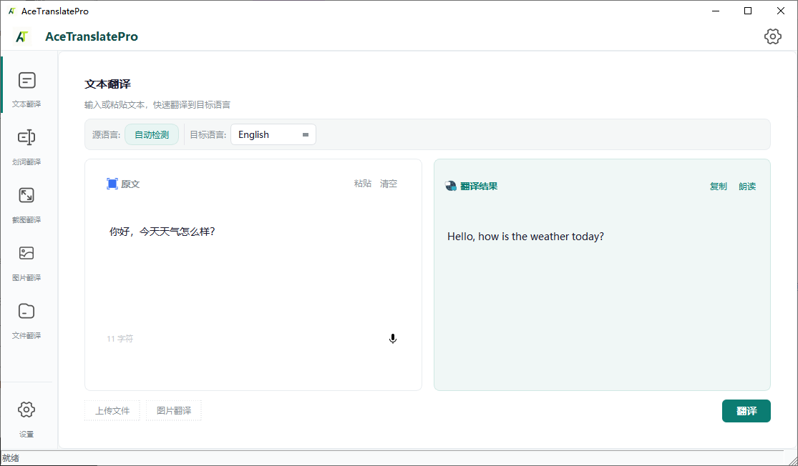
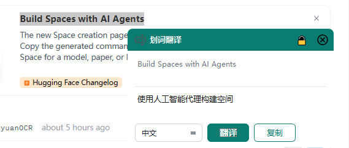
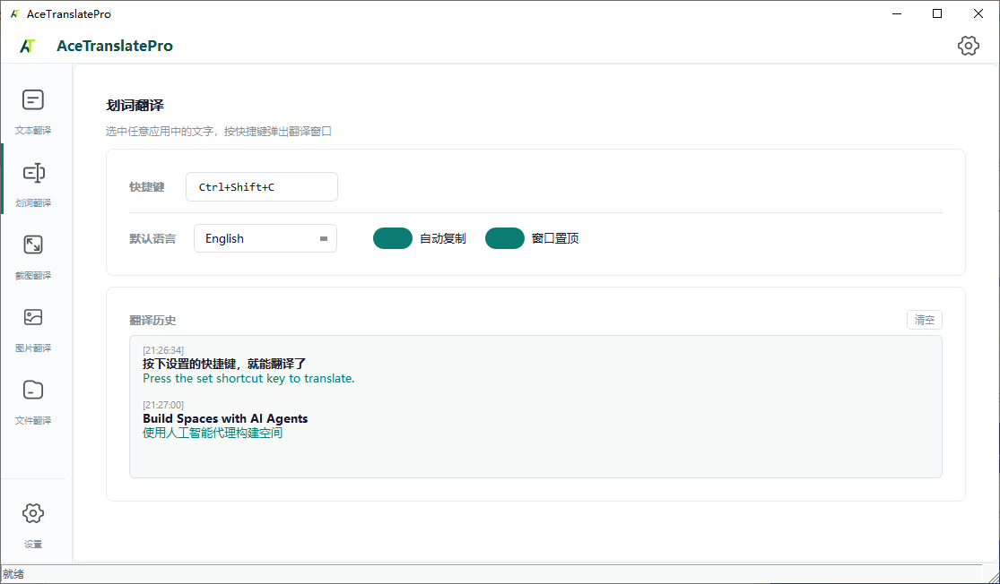
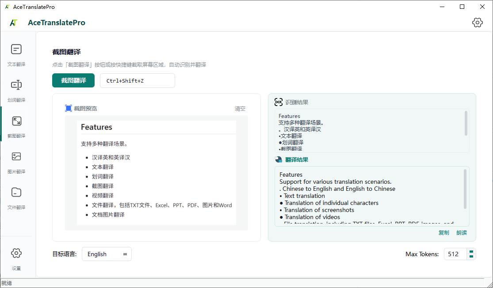
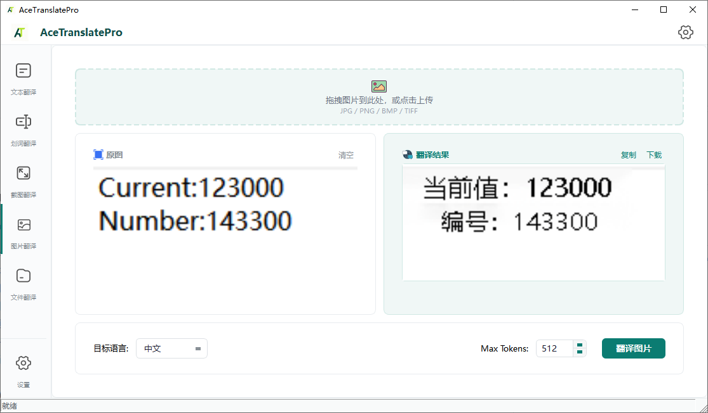
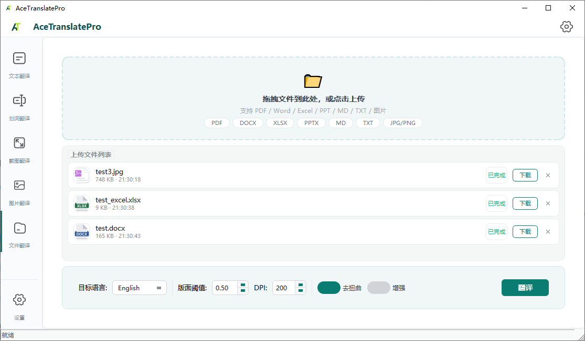
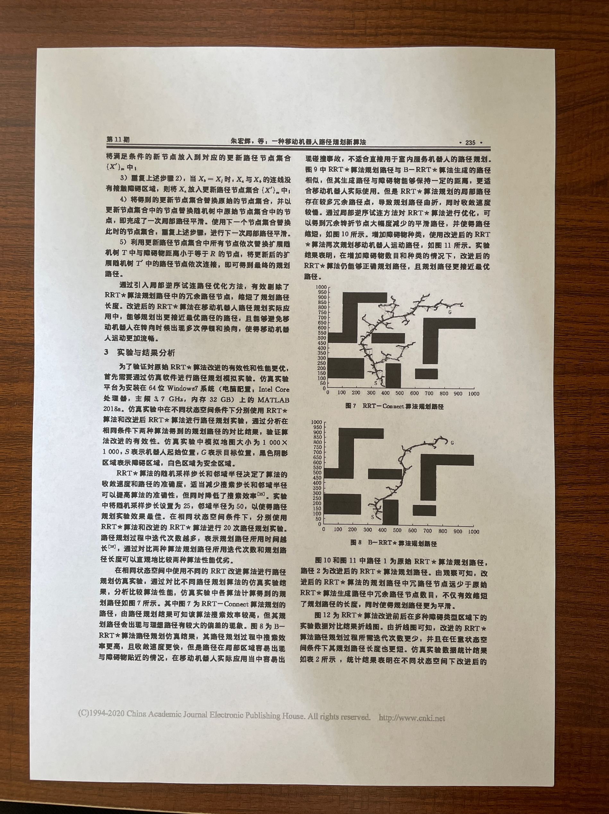
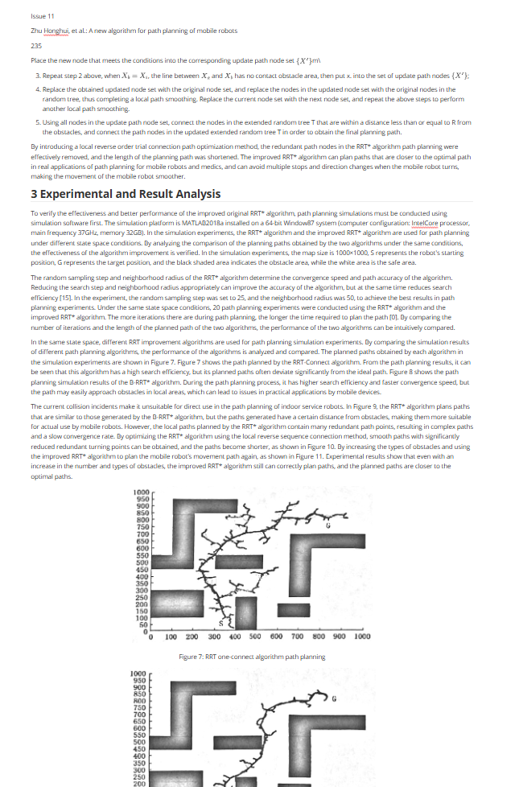

<div align="center">

# AceTranslatePro

**🌐 [中文](./README.md) · [English](./README_en.md) · 日本語**

</div>

---

<div align="center">


# AceTranslatePro

**オールインワンローカル翻訳ツール**

> テキスト翻訳 · 選択翻訳 · スクリーンショット翻訳 · 画像翻訳 · ファイル翻訳 · 音声入力  
> 完全オフライン · プライバシー安全 · GPU/CPU デュアルモード · 多言語ASR · 多言語TTS

<p align="center">
  
  
  
  
</p>

</div>

---

## ✨ 機能一覧

<div align="center">

| 機能 | 説明 | ユースケース |
|------|------|-------------|
| 📝 **テキスト翻訳** | テキストを入力または貼り付けて即時翻訳 | 日常の翻訳ニーズ |
| 🖱️ **選択翻訳** | 任意のアプリで文字を選択、`Ctrl+Shift+C` で翻訳 | 外国語文書の読み物 |
| 📷 **スクリーンショット翻訳** | 画面領域をキャプチャ、自動OCR+翻訳、多言語対応 | 画像内の文字 |
| 🖼️ **画像翻訳** | 画像をアップロード、翻訳後画像にレンダリング | 漫画、ポスター、メニュー |
| 📄 **ファイル翻訳** | PDF/Word/Excel/PPT/MD/TXT 一括文書翻訳 | バッチ文書処理 |
| 🎤 **音声入力** | マイクボタンをクリックして録音、自動音声認識 | 音声入力 |
| 🔊 **読み上げ** | 多言語TTS対応（CN/EN/JP/KO/TA/HIなど） | 翻訳結果を聞く |
| 🌐 **多言語UI** | 中国語/English/日本語 切り替え、ドラッグ可能なナビバー | 多言語ユーザー |

</div>

---

## 🖼️ プレビュー

> *画像をクリックで拡大*



## 📸 翻訳デモ

> *画像をクリックで拡大*

### テキスト翻訳


### 選択翻訳





### スクリーンショット翻訳



### 画像翻訳



### ファイル翻訳


 

---

## 📋 システム要件

- **OS**: Windows 10/11 64-bit
- **CPU**: AVX2対応（2013年以降のIntel/AMDプロセッサ）
- **GPU（オプション）**: NVIDIA GPU + CUDA 12.1、OCR/翻訳/ASRを高速化
- **メモリ**: 16GB以上推奨
- **ストレージ**: 約15GB（モデルファイル含む）

---

## 🚀 クイックスタート

### ビルド済みバージョンをダウンロード

> [Releases](https://github.com/tianclll/Ace-Translate/releases) ページでGPU版とCPU版のパッケージを提供しています。ダウンロードして解凍後すぐに実行できます。

### ソースからビルド

#### 🔧 前提条件

| 依存関係 | バージョン | ダウンロード |
|---------|-----------|-------------|
| Visual Studio 2022 | 17.x | [ダウンロード](https://visualstudio.microsoft.com/)（「C++によるデスクトップ開発」が必要） |
| CMake | ≥ 3.10 | [ダウンロード](https://cmake.org/download/) |
| Qt | 6.5.2 MSVC 2019 64-bit | [ダウンロード](https://www.qt.io/download-open-source) |
| OpenCV | 4.8 | [ダウンロード](https://opencv.org/releases/) |
| ONNXRuntime (GPU) | 1.20.1 (CUDA 12.1) | [ダウンロード](https://github.com/microsoft/onnxruntime/releases) |
| ONNXRuntime (CPU) | 1.20.1 | [ダウンロード](https://github.com/microsoft/onnxruntime/releases) |
| CUDA Toolkit | 12.1 | [ダウンロード](https://developer.nvidia.com/cuda-toolkit)（GPU版のみ） |
| Python | 3.8+ | [ダウンロード](https://www.python.org/downloads/)（office2mdにのみ必要） |

#### 1. llama.cpp をビルド

llama.cpp は事前にビルドしておく必要があります。GPU版は CUDA Toolkit 12.1 が必要です。

```bash
# llama.cpp ソースをクローン（masterブランチ）
# https://github.com/ggml-org/llama.cpp

# GPUビルド
cd external/llama.cpp
cmake -B build_gpu -DGGML_CUDA=ON -DCMAKE_BUILD_TYPE=Release
cmake --build build_gpu --config Release

# CPUビルド
cmake -B build -DGGML_CUDA=OFF -DCMAKE_BUILD_TYPE=Release
cmake --build build --config Release
```

出力先: `build_gpu/bin/Release/`（GPU）または `build/bin/Release/`（CPU）。

#### 2. メインアプリケーションをビルド

```bash
git clone https://github.com/yourusername/AceTranslatePro.git
cd AceTranslatePro
```

<details>
<summary><b>🖥️ GPUビルド（NVIDIA GPU搭載）</b></summary>

```bash
# ワンクリックビルド（推奨）
build_all.bat をダブルクリック

# または手動
mkdir build_all && cd build_all
cmake .. -DCMAKE_BUILD_TYPE=Release
cmake --build . --config Release
```

</details>

<details>
<summary><b>💻 CPUビルド（GPUなし）</b></summary>

```bash
# ワンクリックビルド（推奨）
build_cpu.bat をダブルクリック

# または手動
mkdir build_cpu && cd build_cpu
cmake .. -DCMAKE_BUILD_TYPE=Release
cmake --build . --config Release
```

</details>

#### 📁 モデルファイル

ビルド後、モデルファイルを `build_all/Release/models/`（または `build_cpu/Release/models/`）に配置します：

```
models/
├── translation/                     # 翻訳モデル
│   ├── Hy-MT2-1.8B-Q4_K_M.gguf      # デフォルト翻訳モデル
│   ├── Hy-MT2-1.8B-Q6_K.gguf        # 高精度
│   ├── HY-MT1.5-1.8B-Q4_K_M.gguf    # 旧モデル
│   └── HY-MT1.5-1.8B-Q6_K.gguf      # 旧モデル高精度
├── VLM/
│   └── PaddleOCR-VL-1.6-GGUF*.gguf  # VLM数式認識モデル
├── layout/
│   └── pp_doclayoutv2.onnx          # レイアウト解析モデル
├── ocr/
│   ├── tiny/                        # 軽量（デフォルト）
│   │   ├── det/det.onnx
│   │   ├── rec/rec.onnx
│   │   └── cls/cls.onnx
│   ├── small/
│   └── medium/
├── ASR/
│   ├── model_quant.onnx             # 音声認識（SenseVoiceSmall）
│   ├── am.mvn
│   └── tokens.json
└── uvdoc/
    └── UVDoc_grid.onnx              # 画像補正モデル
```

> **モデルダウンロード**: [Hugging Face 🤗](https://huggingface.co/tianclll/AceTranslatePro-models)

> **注意**: 本プロジェクトは軽量化のため量子化モデルを使用しています（Q4_K_M翻訳、tiny OCR、小型VLMなど）。一般的な用途では十分な性能です。より高精度・多言語対応が必要な場合はお問い合わせください。

---

## ⚙️ 設定

初回実行時に `config.json` が自動生成されます。設定パネルからも変更可能です。

**よく使う設定:**

- **デフォルト言語**: 翻訳先言語を設定（35言語対応、全パネル統一）
- **UI言語**: インターフェース言語を切り替え（中国語 / English / 日本語）、再起動後反映
- **OCRモデルサイズ**: Tiny（軽量）→ Medium（高精度）
- **翻訳モデル**: `models/translation/` を自動スキャン、`.gguf` ファイルを一覧表示
- **起動時エンジン読み込み**: 起動時に読み込むエンジンを選択、オフで起動時間短縮。デフォルトは翻訳エンジンのみ

**GPU設定**（設定 → GPU設定）:

- **マスタースイッチ**: 全エンジンのGPUアクセラレーションを一括有効/無効
- **個別スイッチ**: OCR、レイアウト解析、数式認識、画像補正、翻訳、音声認識を個別に設定

> GPU設定とモデルサイズの変更はアプリ再起動後に反映されます。

---

## ⌨️ ショートカットキー

| ショートカット | 機能 | カスタマイズ |
|--------------|------|------------|
| `Ctrl+Shift+C` | 選択翻訳 | ✅ フロートウィンドウ設定 |
| `Ctrl+Shift+Z` | スクリーンショット翻訳 | ✅ スクリーンショットパネル |

---

## 🏗️ プロジェクト構造

```
AceTranslatePro/
├── 📜 build_all.bat          # GPUビルドスクリプト
├── 📜 build_cpu.bat          # CPUビルドスクリプト
├── 📜 CMakeLists.txt         # GPUビルド設定
├── 📜 CMakeLists_cpu.txt     # CPUビルド設定
│
├── 📂 ui/                    # Qt6 GUI
│   ├── mainwindow.cpp        # メインウィンドウ
│   ├── floatwindow.cpp       # 選択翻訳ポップアップ
│   ├── regioncapture.cpp     # スクリーンショット選択オーバーレイ
│   ├── toast.cpp             # トースト通知
│   ├── zoomablelabel.cpp     # ズーム可能画像ウィジェット
│   ├── style.qss             # グローバルスタイルシート
│   └── i18n/                 # 翻訳ファイル (.ts/.qm)
│
├── 📂 translations/           # Qt翻訳ファイル (zh_CN/en_US/ja_JP)
│
├── 📂 src/                   # C++コアロジック
│   ├── engines/              # DLLラッパー
│   ├── processors/           # 文書処理パイプライン
│   ├── modules/              # ビジネスロジックモジュール
│   ├── core/                 # エンジンコンテキスト & 設定管理
│   └── utils/                # ユーティリティ関数
│
├── 📂 deps/                  # エンジンDLLソース
│   ├── asr/                  # SenseVoice (ONNXRuntime + OpenCV)
│   ├── ocr/                  # PaddleOCR (ONNXRuntime)
│   ├── doclayout/            # レイアウト解析 (ONNXRuntime)
│   ├── vlm/                  # VLMマルチモーダル (llama.cpp)
│   ├── translator/           # 翻訳エンジン (llama.cpp)
│   └── uvdoc/                # 画像補正 (ONNXRuntime)
│
├── 📂 script/                # 補助ツール
│   └── office2md/            # Office → Markdown変換
│
└── 📂 third_party/           # サードパーティライブラリ
    ├── pdfium/               # PDF解析エンジン
    └── nlohmann/             # JSON解析
```

---

## 🧩 技術スタック

<p align="center">
  
  
  
  
  
  
</p>

| コンポーネント | 技術 |
|-------------|------|
| 🖥️ UI | Qt 6.5.2 Widgets（CN/EN/JP 3言語対応、ドラッグ可能ナビバー） |
| 🖼️ 画像処理 | OpenCV 4.8 |
| 🔍 OCR | PaddleOCR (ONNXRuntime) |
| 📐 レイアウト解析 | PPDocLayoutV2 (ONNXRuntime) |
| 🧮 数式認識 | VLMマルチモーダルモデル (llama.cpp) |
| 🌐 翻訳 | ローカルLLM (llama.cpp) |
| 🎤 音声認識 | SenseVoiceSmall (ONNXRuntime + OpenCV FFT) |
| 🔊 TTS | Windows SAPI（自動言語マッチング） |
| 📄 文書解析 | PDFium + office2md (Python) |

---

## 📄 ライセンス

このプロジェクトはMITライセンスの下で公開されています。詳細は [LICENSE](LICENSE) をご覧ください。

> 📌 旧バージョン（Python版）は [`archive/old-python-version`](https://github.com/tianclll/Ace-Translate/tree/archive/old-python-version) ブランチに移行しました。

---

<div align="center">

**Made with ❤️**

より高精度・多言語対応のカスタムモデルやサーバー版については、WeChat: `kriswu1106tc` までお問い合わせください。

</div>
