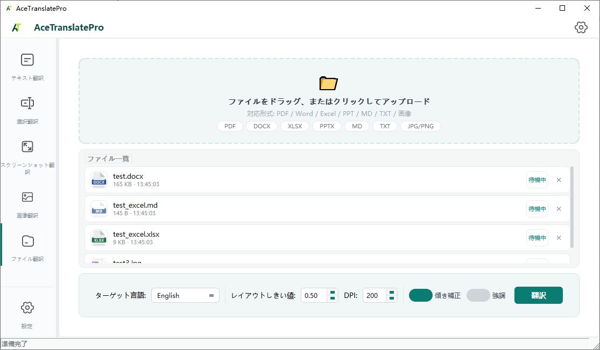
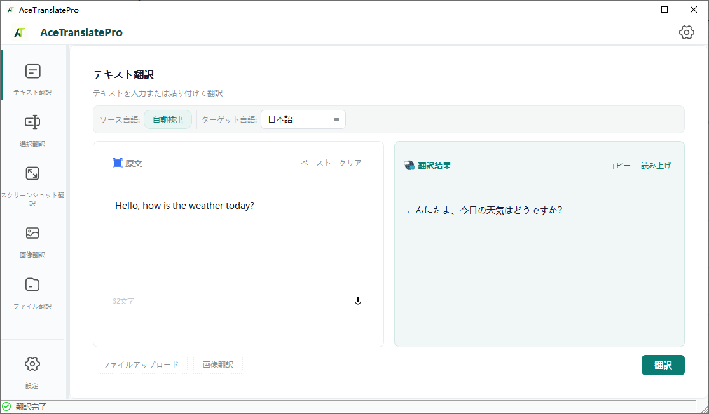

<div align="center">


# AceTranslatePro

**オフラインファイル翻訳ツール**

**🌐 [中文](./README.md) · [English](./README_en.md) · 日本語**

> PDF / Word / Excel / PPT / 画像 → 翻訳後も元のレイアウトを維持
> ローカル実行 · インターネット不要 · プライバシー安全 · GPU/CPU デュアルモード

<p align="center">
  
  
  
  
</p>

</div>

---

## 💡 AceTranslatePro を選ぶ理由

学術論文、技術文書、製品マニュアルを翻訳する際、こんな悩みはありませんか？

- **オンライン翻訳ツール**はファイルアップロードが必要、プライバシーが心配
- **レイアウト崩壊**：PDFの表・数式・画像が翻訳後にぐちゃぐちゃに
- **用語が不一致**：同じ言葉が文書内で違う翻訳に
- **専門用語の精度が低い**：汎用エンジンはあなたの分野を理解しない
- **オフラインで使えない**：出張、研究室、国外でネットがないと使えない

**AceTranslatePro はこれらの問題をすべて解決します。**

すべての処理があなたのPC上で完結。ファイルは外部に送信されない。レイアウトを保持。用語を統一。インターネット不要。

<p align="center">
  
  
</p>

⭐ **お役に立てましたら、Star をお願いします！** 皆さんの応援が改善の原動力です。

---

## 📄 ファイル翻訳

PDF、Word、Excel、PPT、Markdown、TXT、画像に対応。ドラッグ＆ドロップで翻訳。

- **レイアウト保持**：PDF を Markdown に変換、表・見出し・リスト構造を完全維持
- **画像埋め込み**：翻訳後の画像をドキュメントに埋め込み
- **バッチ処理**：複数ファイルをまとめて翻訳


---

## 📚 知識庫 & 用語集

翻訳したドキュメントを一元管理し、個人の翻訳知識庫を構築。

- **ドキュメントアーカイブ**: PDF/Word/Excel/PPT/MD/TXT を取り込み、テキスト抽出・Markdown生成・インデックス構築を自動実行
- **全文検索**: タイトルや内容のキーワードで検索、必要な資料をすぐに見つけられる
- **タグ管理**: ドキュメントにタグ付けして分類整理、バッチタグ付け・エクスポート対応
- **用語集注入**: 専門用語をインポート（例: GPU → グラフィックスプロセッサ）、翻訳時に自動置換で用語統一
- **バッチ操作**: バッチ削除、バッチMarkdownエクスポート対応



---
---

## ✨ その他の機能

| 機能 | 説明 |
|------|------|
| 📝 **テキスト翻訳** | テキストを入力・貼り付けて即時翻訳 |
| 🖱️ **選択翻訳** | 任意のアプリで文字を選択、`Ctrl+Shift+C` で翻訳 |
| 📷 **スクリーンショット翻訳** | 画面領域をキャプチャ、自動OCR+翻訳 |
| 🖼️ **画像翻訳** | 画像をアップロード、翻訳後にレンダリング |
| 🎤 **音声入力** | マイクボタンで録音、音声認識してテキスト化 |
| 🔊 **読み上げ** | 多言語TTS対応（中国語/英語/日本語など） |
| 🌐 **多言語UI** | 中国語 / English / 日本語 切り替え |
| 🔌 **REST API** | 内蔵 HTTP サーバー、16 エンドポイント、スクリプト/Web リモート呼び出し、[ドキュメント](./docs/rest-api.md) |
| 🏷️ **用語集** | 専門用語をインポート、翻訳時に自動注入 |

---

## 📋 システム要件

- **OS**: Windows 10/11 64-bit
- **CPU**: AVX2対応（2013年以降のIntel/AMDプロセッサ）
- **GPU（オプション）**: NVIDIA GPU + CUDA 12.1（OCR/翻訳/ASR高速化）
- **メモリ**: 16GB以上推奨
- **ストレージ**: 約5GB（モデルファイル含む）

---

## 🚀 クイックスタート

### ビルド済みバージョンをダウンロード

> [Releases](https://github.com/tianclll/Ace-Translate/releases) ページでGPU版とCPU版のパッケージを提供しています。

### ソースからビルド

#### 🔧 前提条件

| 依存関係 | バージョン | ダウンロード |
|---------|-----------|-------------|
| Visual Studio 2022 | 17.x | [ダウンロード](https://visualstudio.microsoft.com/) |
| CMake | ≥ 3.10 | [ダウンロード](https://cmake.org/download/) |
| Qt | 6.5.2 MSVC 2019 64-bit | [ダウンロード](https://www.qt.io/download-open-source) |
| OpenCV | 4.8 | [ダウンロード](https://opencv.org/releases/) |
| ONNXRuntime (GPU) | 1.20.1 (CUDA 12.1) | [ダウンロード](https://github.com/microsoft/onnxruntime/releases) |
| ONNXRuntime (CPU) | 1.20.1 | [ダウンロード](https://github.com/microsoft/onnxruntime/releases) |
| CUDA Toolkit | 12.1 | [ダウンロード](https://developer.nvidia.com/cuda-toolkit)（GPU版のみ） |
| Python | 3.8+ | [ダウンロード](https://www.python.org/downloads/)（office2md用） |

> **Python 依存関係**:
> ```bash
> pip install pyinstaller python-docx python-pptx openpyxl lxml pylatexenc
> ```

#### 1. llama.cpp をビルド

```bash
# GPU
cd external/llama.cpp
cmake -B build_gpu -DGGML_CUDA=ON -DCMAKE_BUILD_TYPE=Release
cmake --build build_gpu --config Release

# CPU
cmake -B build -DGGML_CUDA=OFF -DCMAKE_BUILD_TYPE=Release
cmake --build build --config Release
```

#### 2. office2md.exe をビルド

```bash
cd script
pyinstaller --onefile --name office2md --clean ^
    --hidden-import=docx ^
    --hidden-import=pptx ^
    --hidden-import=openpyxl ^
    --hidden-import=lxml ^
    --hidden-import=pylatexenc ^
    cli_converter.py
```

#### 3. メインアプリケーションをビルド

```bash
# GPU版
build_all.bat をダブルクリック

# CPU版
build_cpu.bat をダブルクリック
```

#### 📁 モデルファイル

`Release/models/` にモデルファイルを配置：

```
models/
├── translation/          # 翻訳モデル（.gguf）
├── VLM/                  # 数式認識モデル
├── layout/               # レイアウト解析モデル
├── ocr/                  # OCR検出/認識モデル
├── ASR/                  # 音声認識モデル
└── uvdoc/                # 画像補正モデル
```

> **モデルダウンロード**: [Hugging Face 🤗](https://huggingface.co/tianclll/AceTranslatePro-models)

---

## 🧩 技術スタック

| コンポーネント | 技術 |
|-------------|------|
| 🖥️ UI | Qt 6.5.2 Widgets |
| 🖼️ 画像処理 | OpenCV 4.8 |
| 🔍 OCR | PaddleOCR (ONNXRuntime) |
| 📐 レイアウト解析 | PPDocLayoutV2 (ONNXRuntime) |
| 🧮 数式認識 | VLMマルチモーダルモデル (llama.cpp) |
| 🌐 翻訳 | ローカルLLM (llama.cpp) |
| 🎤 音声認識 | SenseVoiceSmall (ONNXRuntime) |
| 📄 文書解析 | PDFium + office2md (Python) |

---

## 📄 ライセンス

MIT License

> 📌 旧バージョン（Python版）は [`archive/old-python-version`](https://github.com/tianclll/Ace-Translate/tree/archive/old-python-version) ブランチに移行しました。

---

<div align="center">

**Made with ❤️**

カスタムモデルやサーバー版については、`kriswu1106tc` までお問い合わせください。

</div>
